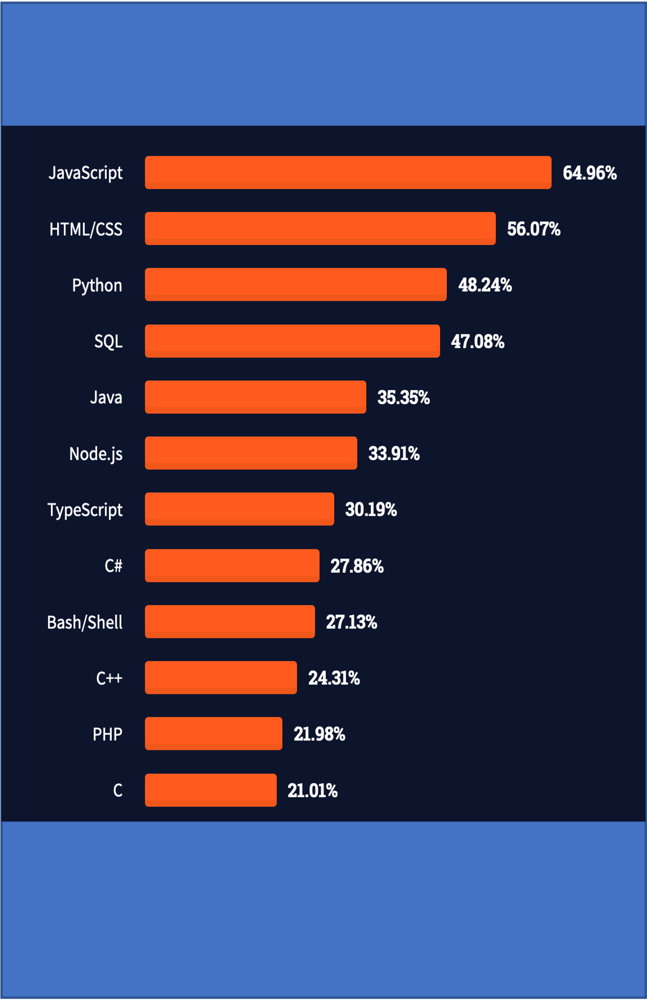
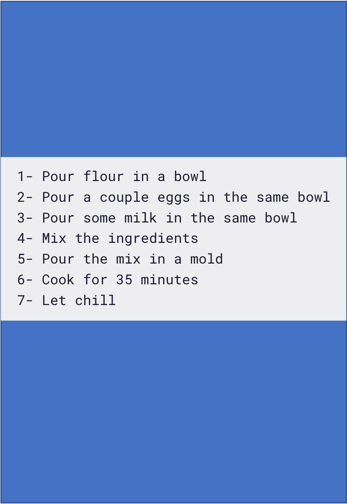
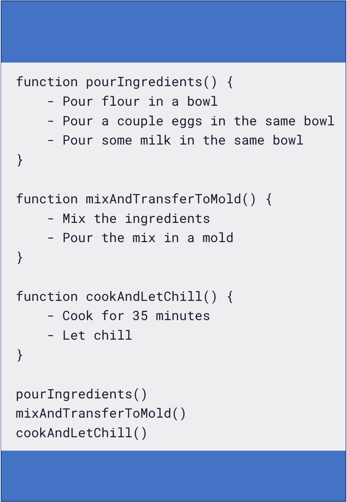
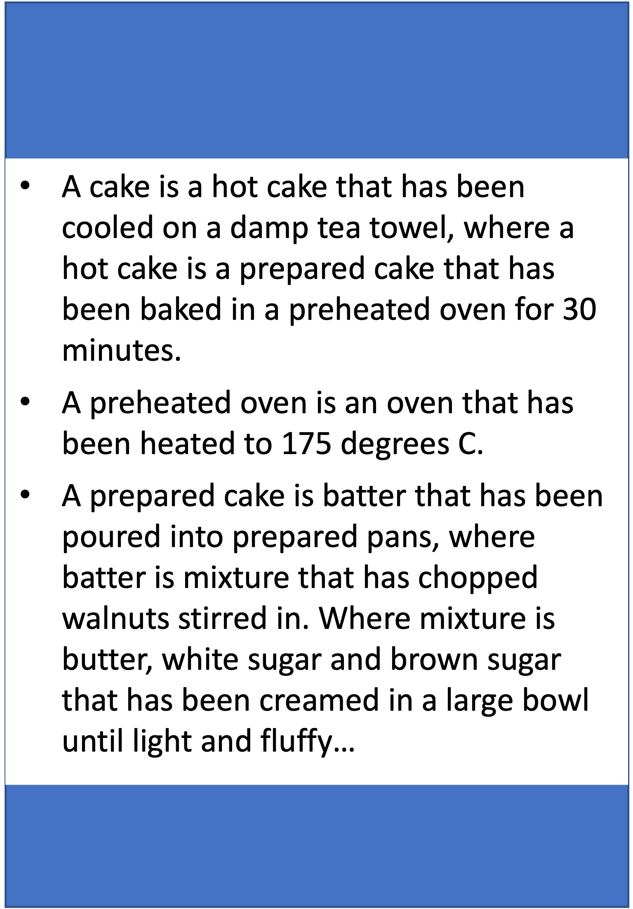
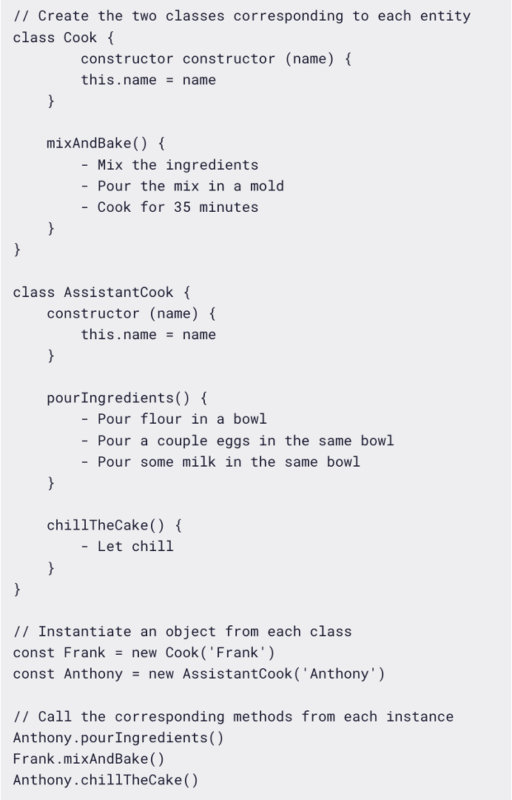
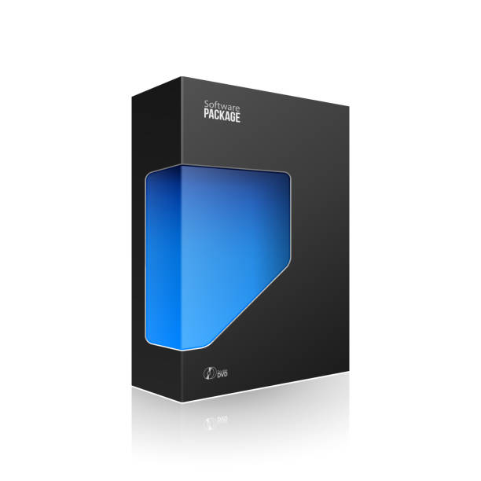
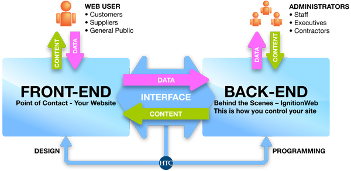
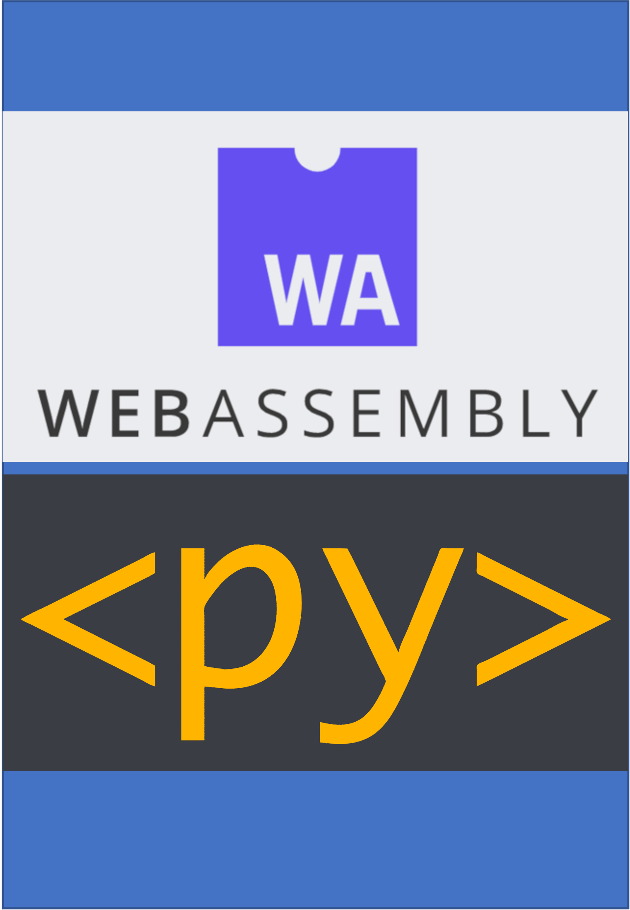

# How to do programming and stuff

## Chris Sewell, 2022

---

# Introduction

Cover some thoughts for creating program applications:

- Environment and source control
- Programming languages
- Code Quality
- Testing
- Type Annotations
- Compilation and packaging
- Distribution
- Usage

---

# Environment and source control

VS Code:

- Free and open source program for managing source files
- Edit, analyze, manage
- Microsoft project, born 2015, now most widely used IDE (71%)
- Extensible
- Git / Github integration

---

# Environment and source control

Conda:

- Package, dependency and environment management for **any/all** language — Python, R, JavaScript, C/ C++, Fortran, ...
- Create multiple environments for different projects
- Can integrate with VS Code Pylance etc.

---

# Programming languages

Pick the one that is best for your use case!

- Assembly: lowest level of abstraction
- C: first dominant high-level language (1972)
- C++: extends C with object-oriented features
- Python: "extends" C++ with memory management, dynamic typing, ...
- Javascript: dominant web scripting language

Resources [Tiobe Index](https://www.tiobe.com/tiobe-index/), [Stack Overflow survey](https://insights.stackoverflow.com/survey/2021)

---

# Programming paradigms

*A set of ideals and guidelines that many people have agreed on, followed, and expanded upon*

Many languages adopt multiple-paradigms, mix the best for the job!

---

# Programming paradigms

**Imperative**:

- Sets of detailed instructions that are given to the computer to execute in a given order.
- Focuses on describing how a program operates, step by step.

---

# Programming paradigms

**Procedural**:

- A derivation of imperative programming, adding to it the feature of functions (also known as "procedures" or "subroutines").
- User is encouraged to subdivide the program execution into functions, as a way of improving modularity and organization

---

# Programming paradigms

**Functional**:

- Functions are treated as first-class citizens: can be assigned to variables, passed as arguments, and returned from other functions.
- No side effects: a pure function is one that relies only on its inputs to generate its result.
- Improves the code maintainability, but can be difficult to think about.

---

# Programming paradigms

**Declarative**:

- All about hiding away complexity and bringing programming languages closer to human language and thinking.
- Under the hood, the computer processes this information as imperative code anyway.
- SQL a good example of this.

---

# Programming paradigms

**Object-Oriented**:

- Separate concerns into entities which are coded as objects.
- Each entity will group a given set of information (properties) and actions (methods) that can be performed by the entity.
- Facilitates the understanding of a program, by the clear separation of concerns and responsibilities, but internal state can be difficult to understand.

---

# Creating a project

Whatever language you use, many steps will be similar:

- Code Quality
  - Formatting
  - Linting
  - Typing
- Testing
  - Test driven development
- Compilation and packaging
- Distribution

---

# Web development

---

# Web Assembly (WASM)

*Write languages for the web, in languages other than JavaScript!*

- Became an official web standard in 2019
- Includes low-level language (`.wat`), used as a compile target, then converted to binary format (`.wasm`)
- [Pyodide](https://pyodide.org) is a port of CPython to WebAssembly, used by [pyscript](https://pyscript.net/)
